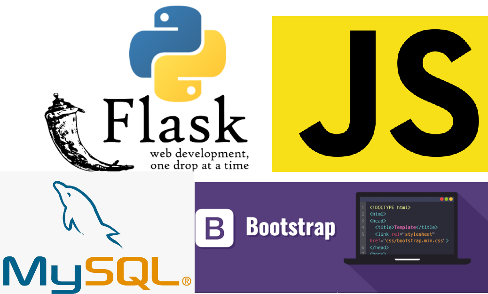

# Flask and MySQL Form - Restful API (CRUD) with sql queries
### Check the App here: https://crudformapp.herokuapp.com/
At this repo we'll build a web app using flask (python) and mysql as our backend, we'll also use bootstrap to give some style to the front-end and javascript for a couple of tricks.  
After that the app can be deployed to heroku, in a simple way.

### This is the Tech. Stack used here:

### Flask and MySQL Crud-Form App
  The tutorial to build the form app running locally with flask and mysql can be found: [Here](https://www.youtube.com/watch?v=IgCfZkR8wME). Credits goes to <b>Fazt Code Channel on youtube</b>
  

### Deploying to Heroku
To create the deployment to heroku you'll have to do some things - use this tutorial if you will: [Here](https://www.youtube.com/watch?v=JBGC9Dp9cXI)  
<ul>
  <li>Create an account in Heroku</li>
  <li>Install Python in your machine and create a virtual environment</li>
  <li>Initiate a Git Repository inside your app folder (Heroku asks for it)</li>
  <li>Create the Procfile and configure it (already included in the files here)</li>
  <li>Install the needed dependencies of your project in your virtual environment</li>
  <li>Use the command "pip freeze > requirements.txt" to generate the requirements (already included here)</li>
  <li>Using the terminal, login to heroku "heroku login"</li>
  <li>Create your heroku app with "heroku create appname"</li>
  <li>"git add .", git commit -m "commit message" and to start deploying your app:</li>
  <li>git push heroku master</li>
  
