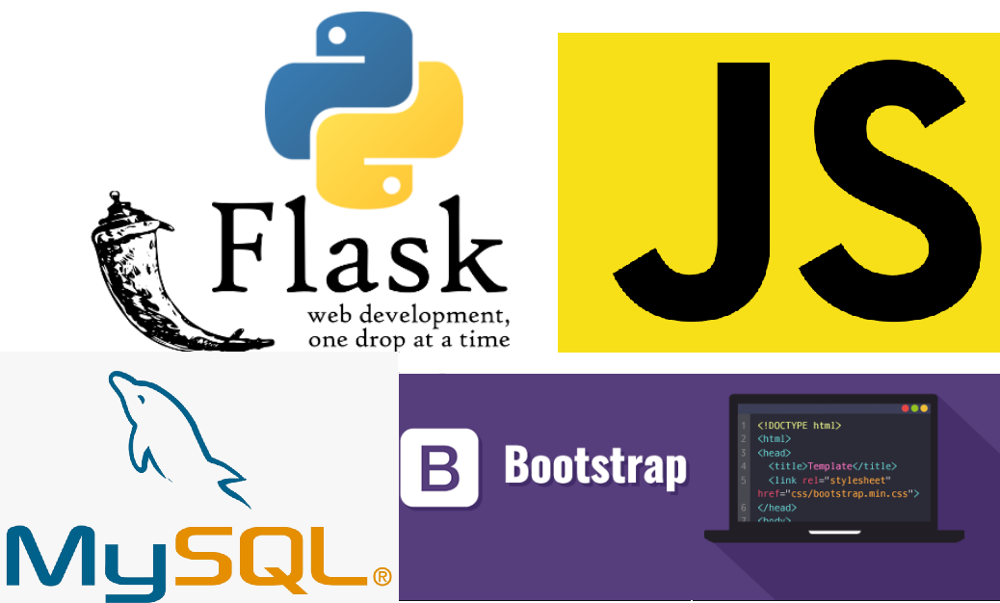

# Flask and MySQL Form
At this repo we'll build a web app using flask (python) and mysql as our backend, we'll also use bootstrap to give some style to the front-end and javascript for a couple of tricks.  
After that the app can be deployed to heroku, in a simple way.

### This is the Tech. Stack used here:

### Flask and MySQL Crud-Form App
  The tutorial to build the form app running locally with flask and mysql can be found: <a src='https://www.youtube.com/watch?v=IgCfZkR8wME'>here<a>. Credits goes to <b>Fazt Code Channel on youtube</b>
  

### Deploying to Heroku
To create the deployment to heroku you'll have to do some things:  